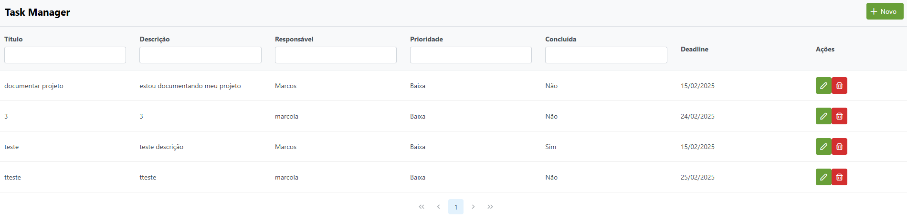

                                                                        PROJETO TASK MANAGER


Este projeto tem como objetivo ser um gerenciador de tarefas aonde o usuário cadastra seu titulo, descrição, responsável e deadline, implementado com Jakarta EE, usando WildFly como servidor de aplicação e PostgreSQL como banco de dados. A página principal (index.xhtml) contém um formulário para cadastro de tarefas, uma tabela para exibição de registros e opções de filtragem, além de funcionalidades de edição e exclusão dos registros.



Estrutura do Projeto
A estrutura do projeto é a seguinte:

```
└── src
    ├── main
    │   ├── java
    │   │   └── com
    │   │       └── taskmanager
    │   │           ├── controller
    │   │           │   └── TaskController.java
    │   │           ├── model
    │   │           │   └── entity
    │   │           │       └── Task.java
    │   │           ├── repository
    │   │           │   ├── persistence
    │   │           │   │   ├── CrudRepository.java
    │   │           │   │   └── Repository.java
    │   │           │   └── TaskRepository.java
    │   │           ├── service
    │   │           │   ├── impl
    │   │           │   │   └── TaskServiceImpl.java
    │   │           │   └── TaskService.java
    │   ├── resources
    │   │   └── META-INF
    │   │       └── persistence.xml
    │   └── webapp
    │       ├── WEB-INF
    │       │   └── web.xml
    │       └── index.xhtml
└── pom.xml
```
Dependências
Este projeto usa as seguintes dependências:

```
<dependency>
    <groupId>jakarta.platform</groupId>
    <artifactId>jakarta.jakartaee-api</artifactId>
    <version>10.0.0</version>
    <scope>provided</scope>
</dependency>

<dependency>
    <groupId>jakarta.faces</groupId>
    <artifactId>jakarta.faces-api</artifactId>
    <version>4.0.1</version>
    <scope>provided</scope>
</dependency>

<dependency>
    <groupId>jakarta.enterprise</groupId>
    <artifactId>jakarta.enterprise.cdi-api</artifactId>
    <version>4.0.1</version>
    <scope>provided</scope>
</dependency>

<dependency>
    <groupId>jakarta.xml.bind</groupId>
    <artifactId>jakarta.xml.bind-api</artifactId>
    <version>4.0.2</version>
</dependency>

<dependency>
    <groupId>org.postgresql</groupId>
    <artifactId>postgresql</artifactId>
    <version>42.7.4</version>
</dependency>

<dependency>
    <groupId>org.hibernate.orm</groupId>
    <artifactId>hibernate-core</artifactId>
    <version>6.6.1.Final</version>
</dependency>

<dependency>
    <groupId>org.hibernate</groupId>
    <artifactId>hibernate-entitymanager</artifactId>
    <version>5.6.15.Final</version>
</dependency>

<dependency>
    <groupId>org.hibernate.orm</groupId>
    <artifactId>hibernate-jpamodelgen</artifactId>
    <version>6.6.1.Final</version>
</dependency>

<dependency>
    <groupId>org.primefaces</groupId>
    <artifactId>primefaces</artifactId>
    <version>14.0.6</version>
    <classifier>jakarta</classifier>
</dependency>

<dependency>
    <groupId>org.webjars.npm</groupId>
    <artifactId>primeflex</artifactId>
    <version>3.3.1</version>
</dependency>

<dependency>
    <groupId>org.projectlombok</groupId>
    <artifactId>lombok</artifactId>
    <version>1.18.34</version>
    <scope>provided</scope>
</dependency>
```

Banco de Dados
Script para Criação do Banco de Dados
Crie o banco de dados taskmanager e a tabela tasks utilizando o seguinte script SQL:


```

CREATE TABLE tasks (
    id SERIAL PRIMARY KEY,
    titulo VARCHAR(255) NOT NULL,
    descricao TEXT,
    responsavel VARCHAR(100) NOT NULL,
    prioridade VARCHAR(20) CHECK (prioridade IN ('Alta', 'Média', 'Baixa')),
    deadline DATE NOT NULL,
    concluida BOOLEAN DEFAULT FALSE
);
```

Configuração do PostgreSQL no WildFly
Baixe o driver JDBC do PostgreSQL em PostgreSQL JDBC Driver.
https://jdbc.postgresql.org/

Baixe a versão .jar mais recente do driver, por exemplo, postgresql-42.x.x.jar.
Passo 2: Adicionar o Driver no WildFly
baixe o wildfly versão 34.0.0.final e extrair o arquivo .rar
Navegue até o diretório de instalação do WildFly:


Configuração do WildFly
Passo 1: Criar um Usuário Administrativo no WildFly
Acesse o diretório bin do WildFly.


No Windows:

```
add-user.bat
```
No Linux/Mac:

```
./add-user.sh
```

Selecione a opção Management User e atribua o role1 ao novo usuário.

Passo 2: Configurar o DataSource no WildFly
Rode seu projeto no netbeans
Acesse a interface de administração do WildFly pelo link:

```
http://localhost:8080
```

 20.47.06_0c264d66.jpg>)


Faça login com o usuário e senha criados.


No painel de administração, vá até deployments e siga o fluxo das imagens

 20.47.19_5edbccca.jpg>)

Adicione um novo deployment e escolha o PostgreSQL JDBC Driver.jar que vc baixou

 20.47.40_95ec81cd.jpg>)

Finalize

 20.48.25_cdd7bce0.jpg>)

Siga o fluxo Configuration > subsystems > datasource & drivers >  datasources > add 

 20.49.05_dc20e4da.jpg>)

Selecione postgreSQL como o data source

 20.49.19_0519d618.jpg>)

Escolha o arquivo escolha o PostgreSQL JDBC Driver.jar que vc baixou

 20.51.19_7ee683c4.jpg>)

Coloque a string de conexão igual a da foto, seu nome de usuário do pgadmin e sua senha do pgadmin

 20.51.49_9fc17904.jpg>)


Após isso teste a conexão e está se tudo ocorrer bem o wildfly está configurado corretamente


